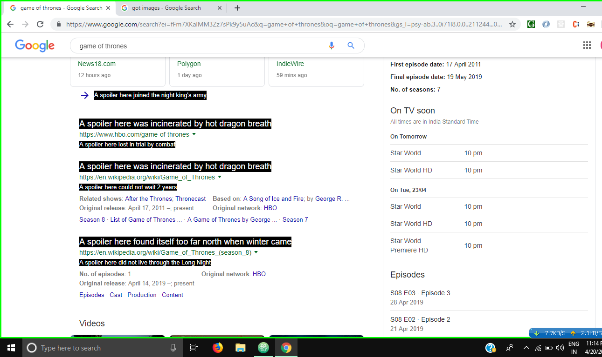
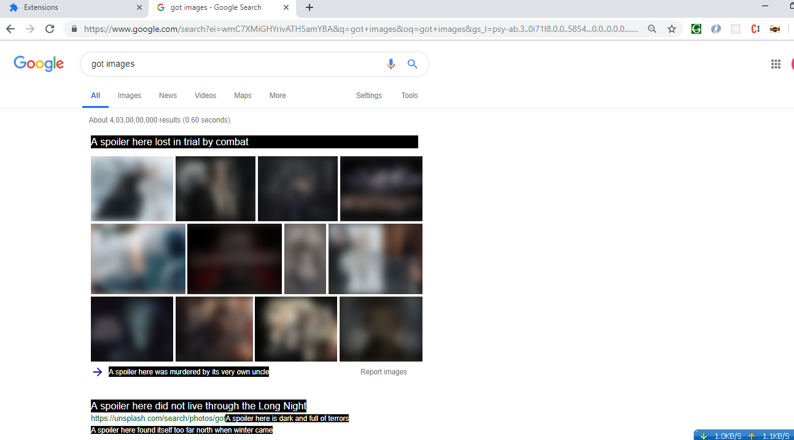

# :sparkles: GOT-Spoiler-Blocker :sparkles:
This chrome extension will save you from getting any spoilers related to Game of Thrones  
This project is also beginner friendly and if you are looking for your very first PR's your are at the right place!
And, no spoilers please ;)

  

# Features
- **Spoiler Blocking**: Searches entire web page and replaces Spoilers in a creative way.
- **Image Blurring**: Blurs the neighbouring Images which are relevant and might reveal the Spoiler information.
- **GOT References**: Replaces the spoilers with GOT references, use it to find out more.

# Installation
- Fork and clone this repository to your computer if you want to contribute as well as use this extension.
- You can also download it as a zip file.
- Go to `chrome://extensions`
- Enable developer options and now click on Load unpacked extension
- Select the path where you cloned/downloaded this project.

# Contribution
Any improvements are welcome, coz we all love GOT right?  
If you want a new feature to be added to this extension or find any bugs, please create a new issue.
Also I encourage you to make your very first chrome extension if you haven't before, even if it is a simple one!

